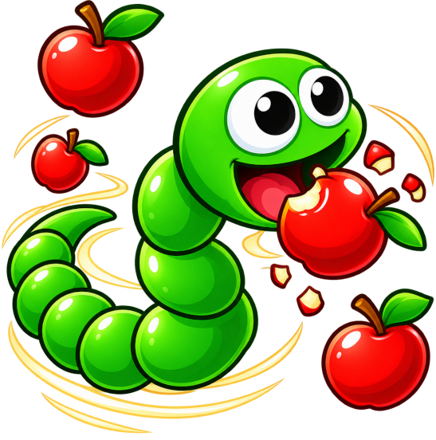
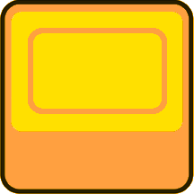
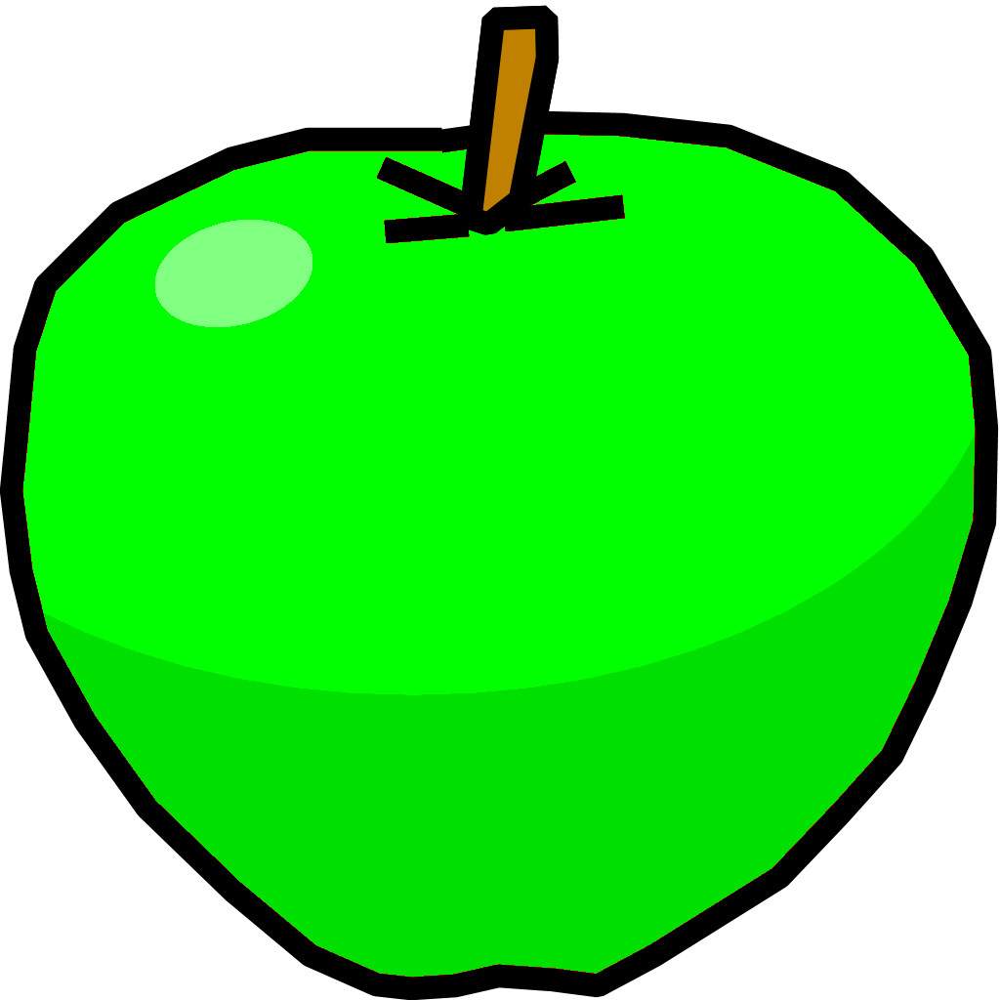
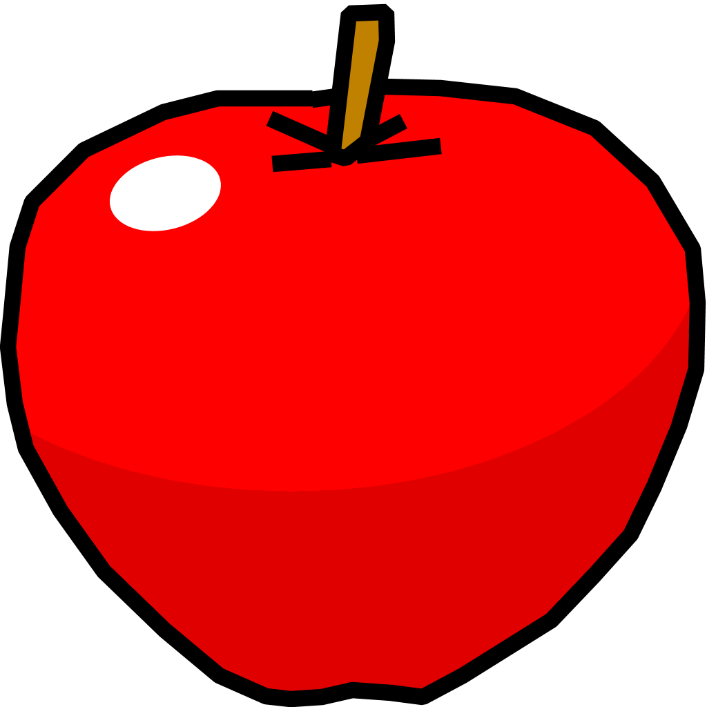
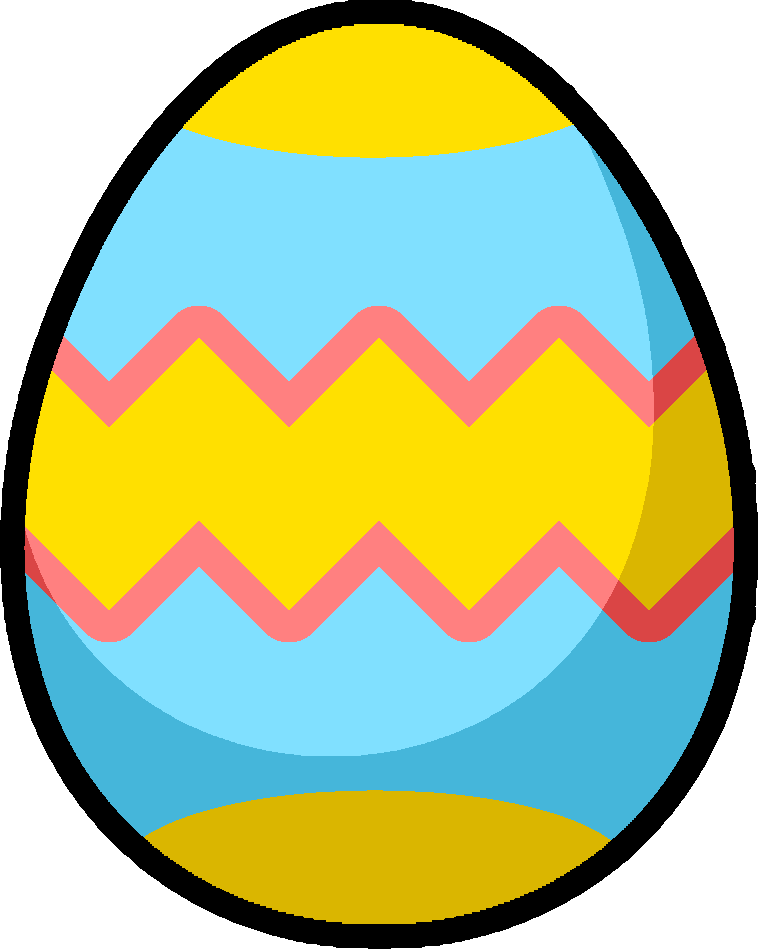
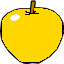
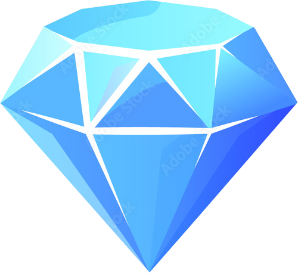

## Snake XX

Snake XX is the classic snake game for android with some additional mechanics written using Jetpack Compose.

## How to play
### Grow snake
<table>
  <tr>
    <td>
      
    </td>
    <td>
      <ul>
        <li>collect apples and bonuses and increase the snake length</li>
        <li>earn points for growing your snake and completing levels</li>
      </ul>
    </td>
  </tr>
</table>

### Pass levels
<table>
  <tr>
    <td>
      
    </td>
    <td>
      <ul>
        <li>to pass the level reach the length displayed on top of the screen</li>
        <li>walls position, game speed and intelligence of the second snake changes with each level</li>
      </ul>
    </td>
  </tr>
</table>

### Collect coins
<table>
  <tr>
    <td>
      
    </td>
    <td>
      <ul>
        <li>collect coins and diamonds on game field</li>
        <li>buy skins, upgrades and boosters for earned coins</li>
      </ul>
    </td>
  </tr>
</table>

### Avoid reduction
<table>
  <tr>
    <td>
      
    </td>
    <td>
      <ul>
        <li>avoid walls, enemy snake, bad items and your tail</li>
        <li>this things reduce your size or finish game</li>
      </ul>
    </td>
  </tr>
</table>

## Apples and items

### Green apple
<table>
  <tr>
    <td>
      
    </td>
    <td>
      <ul>
        <li>increases snake length by one</li>
        <li>gives you one game point</li>
      </ul>
    </td>
  </tr>
</table>

### Red apple
<table>
  <tr>
    <td>
      
    </td>
    <td>
      <ul>
        <li>does the same as green apple</li>
      </ul>
    </td>
  </tr>
</table>

### Omnivorousness egg
<table>
  <tr>
    <td>
      
    </td>
    <td>
      <ul>
        <li>activates omnivorousness mode where you can eat any items and grow</li>
        <li>the mode continues until the snake's head changes back to the normal one</li>
        <li>increases snake length by one</li>
      </ul>
    </td>
  </tr>
</table>

### Golden apple
<table>
  <tr>
    <td>
      
    </td>
    <td>
      <ul>
        <li>turn all bad items on the screen to apples</li>
        <li>increases snake length by one</li>
      </ul>
    </td>
  </tr>
</table>

### Stone
<table>
  <tr>
    <td>
      
    </td>
    <td>
      <ul>
        <li>decreases snake length by one</li>
        <li>game will be finished if snake length became less than two</li>
      </ul>
    </td>
  </tr>
</table>

### Bomb
<table>
  <tr>
    <td>
      
    </td>
    <td>
      <ul>
        <li>shrinks snake length to initial</li>
        <li>than game will be finished if snake is already has initial length</li>
      </ul>
    </td>
  </tr>
</table>

### Coin
<table>
  <tr>
    <td>
      
    </td>
    <td>
      <ul>
        <li>adds 2 coins to balance</li>
      </ul>
    </td>
  </tr>
</table>

### Diamond
<table>
  <tr>
    <td>
      
    </td>
    <td>
      <ul>
        <li>adds 10 coins to balance</li>
      </ul>
    </td>
  </tr>
</table>
